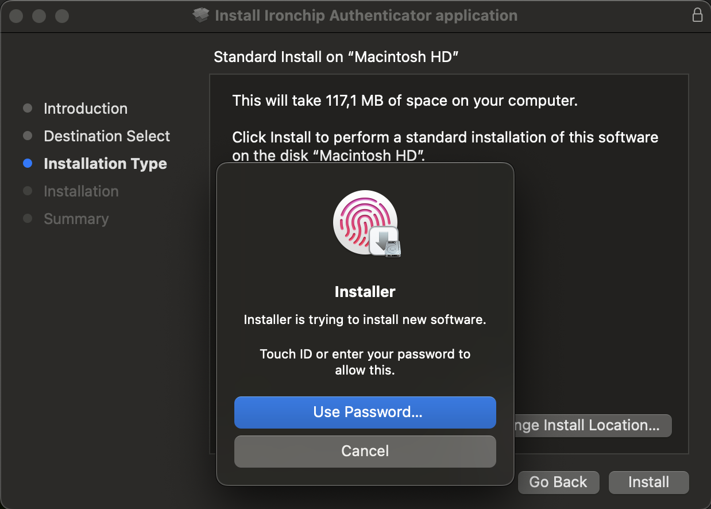
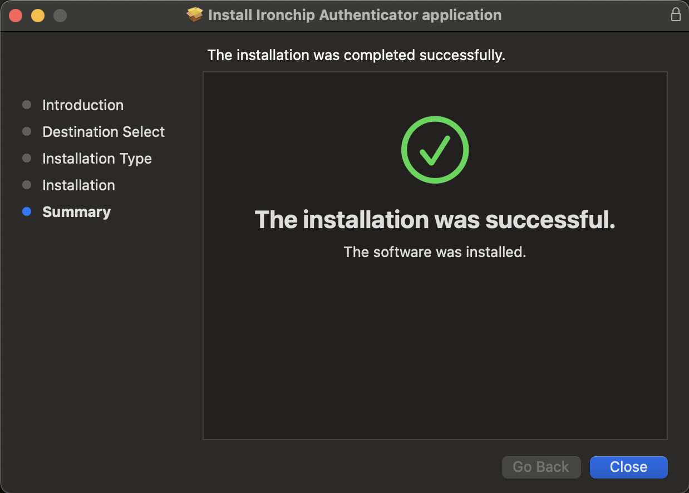
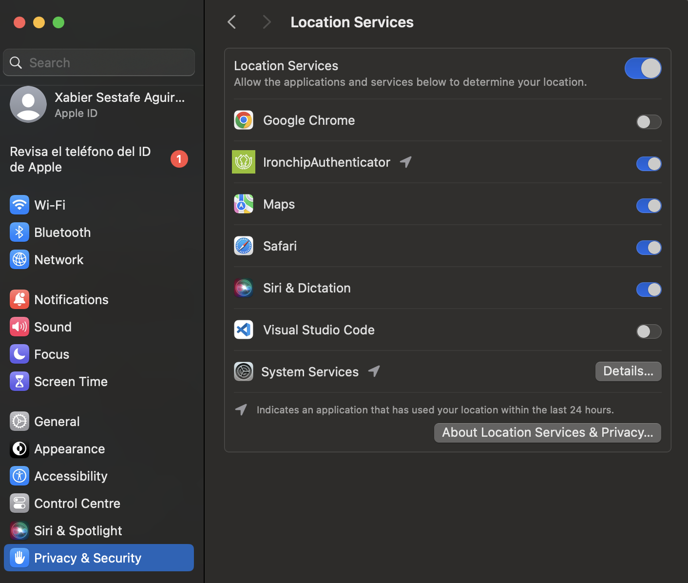
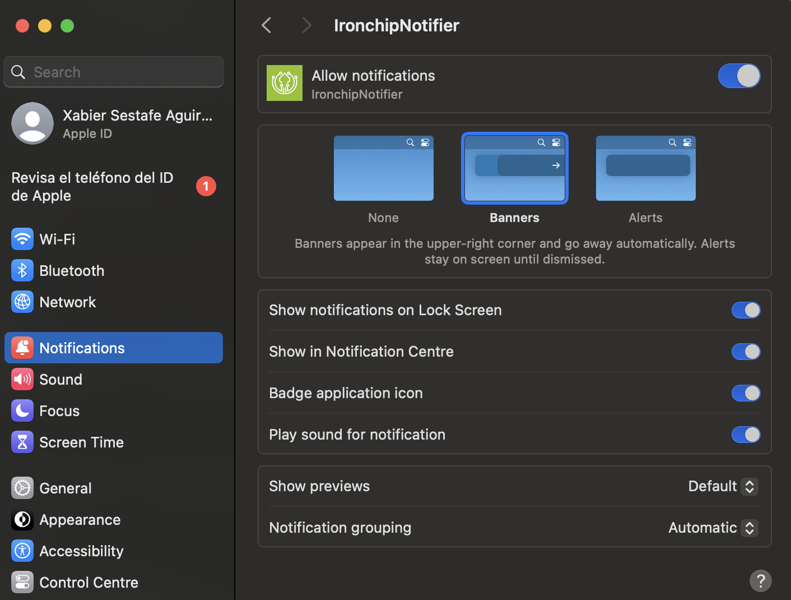

<p align="center">
  
</p>
<h1 align="center">Ironchip</h1>

<p align="center" back>
    <a href="https://support.apple.com/en-us/102662">
    
  </a>
  
  <a href="https://github.com/Ironchip-Security/Ironchip-MAC-Authenticator/releases">
    
  </a>
  
  <a href="https://github.com/Ironchip-Security/Ironchip-MAC-Authenticator/releases">
    
  </a>
</p>

## IDENTITY PROTECTION

Elevate your cybersecurity strategy with Ironchip Identity Platform, designed to bring the power of Multi-Factor Authentication (MFA) to your desktop computing environment. [Know more](https://www.ironchip.com/solutions/identity_platform/win-mac-linux/).

**Role-based privilege management:**
Set different user privileges. Prevents unauthorized users from accessing the rest of the system and misusing information, mitigating malicious users.

**Restrict access from unauthorized places:**
Generate enabled access from authorized areas and take your security to the next level.

**Supervision of accesses in real time:**
Check user activity, view access on a timeline, get reports and download them for full control.

**Intrusion detection system (IDS):**
Location-based reporting system to alert of sim swapping, phishing, device switching, etc.

<p align="center">
 <a href="https://www.youtube.com/watch?v=G-rr6BzcQZ0"> 
  
 </a>
</p>

## Download

Download the latest installer (`.pkg`) version from [Release](https://github.com/Ironchip-Security/Ironchip-MAC-Authenticator/releases).

> **Apple Silicon**: Make sure to download the `ironchip_authenticator_1.0.0_arm64.pkg` file if you’re on a Mac with Apple Silicon chip.

> **Intel**: If you’re on a Mac with an Intel processor, download the `ironchip_authenticator_1.0.0_x86_64.pkg` file.
</br>

## Desktop Application

### What it is

Identity management must be nowadays considered as an essential component for security in organizations. To address this need, Ironchip provides organizations with the scalability and security necessary to offer their users a consistent experience and a reduced risk of vulnerabilities.

**Get a notification on your device**
Communication for authentication is done over a double-encrypted channel which implements a TLS plus asymmetric elliptic key encryption.

### Installing process

To install the Ironchip Authenticator into your device:
 - Navigate to the folder that contains the downloaded file and open it to launch the installation program:
   
   <p align="center">
     
   </p>
   
 - To ensure security, you will be prompted to enter your password or use Touch ID. This authorizes the operation and allows the installation to proceed.

   <p align="center">
     
   </p>

 - Once the installation process is finished. All you need to do is [enroll the device](https://knowledge.ironchip.com/en/aplicaci%C3%B3n-de-escritorio#registro), and you are good to go.

   <p align="center">
     
   </p>
   
### Additional information to ensure optimal use of the application

**Location Permissions:** Make sure to grant location permissions. It serves to enhance the Intrusion Detection System (IDS) and provide more effective alerts regarding SIM card changes, phishing attempts, device switches, and other suspicious or fraudulent actions.

Navigate to System Settings, click on Privacy & Security in the sidebar, and then select Location Services on the right.” 
System Settings, click Privacy & Security in the sidebar, then click Location Services on the right.
   <p align="center">
     
   </p>
   
**Notifications:** Enable notifications to receive important alerts.

To change these settings, choose Apple menu > System Settings, then click Notifications in the sidebar.

   <p align="center">
     
   </p>

### Installing Application via command line

To install a .pkg file on macOS from the command line, follow these steps:

 ```bash
curl -L -o /tmp/package.pkg https://github.com/Ironchip-Security/Ironchip-MAC-Authenticator/releases/download/1.0.0/ironchip_authenticator_1.0.0_arm64.pkg && sudo installer -pkg /tmp/package.pkg -target /
 ```
Make sure that the URL corresponds with to a valid version of the package.

### Uninstalling Application

To uninstall the application from your Mac, follow these steps:

1. **Open Terminal**:
   - You can find Terminal in `Applications > Utilities > Terminal`.

2. **Run the Uninstall Command**:
   - Type the following command in Terminal and press `Enter`:
   
     ```bash
     sudo ironchip uninstall
     ```
   - You will be prompted to enter your administrator password.

### How to disable USB
  
  1. **Open Terminal**:
   - You can find Terminal in `Applications > Utilities > Terminal`.

  2. **Run the Command**:
   - Type the following command in Terminal and press `Enter`:
   
     ```bash
     sudo ironchip configure --restrict-usb=true
     ```
   - You will be prompted to enter your administrator password.

### How to enable proxy
  Automatic Proxy: If you enable this option, the application will use the proxy configured in the system.
  
  1. **Open Terminal**:
   - You can find Terminal in `Applications > Utilities > Terminal`.

  2. **Run the Command**:
   - Type the following command in Terminal and press `Enter`:
   
     ```bash
       sudo ironchip configure --proxy-enable=true
     ```
     Manual Proxy: If you prefer to configure the proxy manually, the application will take the proxy details from the config.json file.

    ```bash
      sudo ironchip configure --proxy-manual=true --proxy-manual-uri 127.0.0.1:8080
     ```

### Help section
  If you need more information about the available options for the command, you can access the help menu by using the -h or --help option.
```bash
sudo ironchip configure -h
```
```bash
sudo ironchip service -h
```
